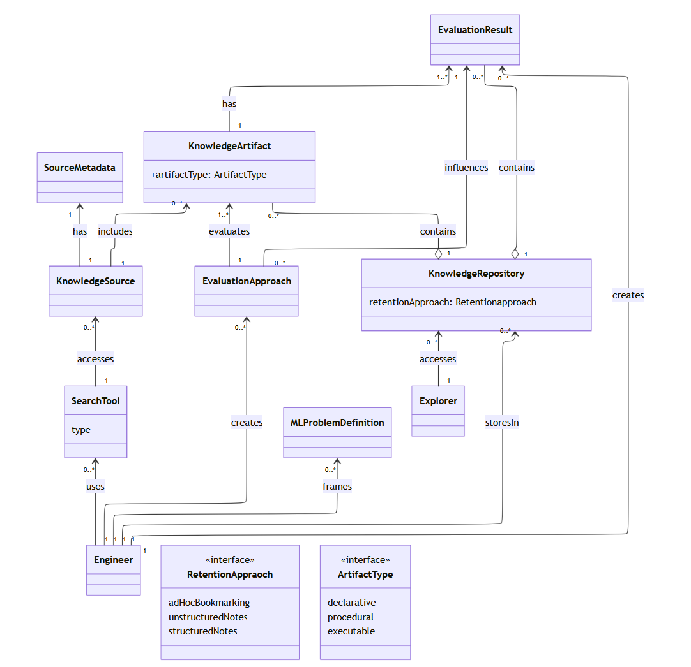

## Domain Model



## Mermaid Code

```
---
config:
  layout: elk
---
classDiagram
direction BT
    class Engineer {
    }
    class Explorer {
    }
    class MLProblemDefinition {

    }
    class KnowledgeSource {

    }
    class KnowledgeArtifact {
	    +artifactType: ArtifactType
    }
    class KnowledgeRepository {
	    retentionApproach: Retentionapproach
    }
    class RetentionAppraoch {
	    adHocBookmarking
	    unstructuredNotes
	    structuredNotes
    }
    class ArtifactType {
	    declarative
	    procedural
	    executable
    }
    class EvaluationApproach {

    }
    class EvaluationResult {
    }
    class SearchTool {
	    type
    }
    class SourceMetadata {
    }

	<<interface>> RetentionAppraoch
	<<interface>> ArtifactType

    Engineer "1" --> "0..*" MLProblemDefinition : frames
    Engineer "1" --> "0..*" SearchTool : uses
    SearchTool "1" --> "0..*" KnowledgeSource : accesses
    KnowledgeSource "1" --> "1" SourceMetadata : has
    KnowledgeSource "1" --> "0..*" KnowledgeArtifact : includes
    Engineer "1" --> "0..*" EvaluationApproach : chooses
    EvaluationApproach "1" --> "1..*" KnowledgeArtifact : evaluates
    EvaluationApproach "1" --> "1..*" KnowledgeSource : evaluates
    Engineer "1" --> "0..*" EvaluationResult : creates
    KnowledgeArtifact "1" --> "1..*" EvaluationResult : has
    EvaluationApproach "0..*" --> "1"  EvaluationResult: influences
    Engineer "1" --> "0..*" KnowledgeRepository : storesIn
    KnowledgeRepository "1" o-- "0..*" KnowledgeArtifact : contains
    KnowledgeRepository "1" o-- "0..*" EvaluationResult : contains
    Explorer "1" --> "0..*" KnowledgeRepository : accesses
```
