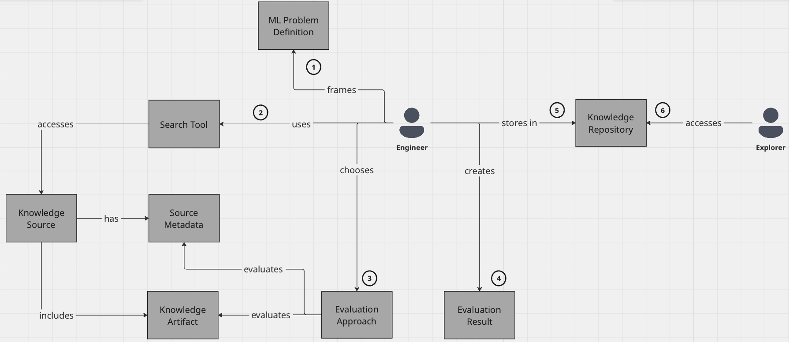

## Domain Glossary

## Actors

* **Engineer:** AI practitioner or researcher. A technical user who explores, designs, and develops AI/ML solutions.
* **New User:** An individual (e.g., another researcher or team member) who accesses the Repository to find and reuse the curated knowledge, evaluation results, and artifacts previously saved by an Engineer.

## Core concepts

| **Concept** | **Definition** | **Examples** |
| ------ | ----- | ------- |
| **ML Problem Definition** | A description of the task or challenge the Engineer is trying to solve, which guides their search and evaluation. | "How to accelerate learning in Neural Network" |
| **Search Tool** | The system or interface the Engineer interacts with to find Knowledge Sources.  | Google, Google Scholar |
| **Knowledge Source** | The origin of information containing Knowledge Artifact | Blog entry, academic publication, documentation, git repo |
| **Knowledge Artifact** | A specific piece of knowledge from Knowledge Source that can be evaluated and reused | Code snippet, pretrained model, description of an algorithm |
| **Source Metadata** | Data describing a Knowledge Source | Author, publisher, publication date, number of citations |
| **Evaluation Approach** | The method or framework a user applies to evaluate the Knowledge Artifact.  | Quality-based, intuition-based |
| **Evaluation Result** | The outcome of the Engineer's assessment of a Knowledge Artifact or Source, based on a specific Evaluation Approach. | Credibility, reusability, relevance |
| **Knowledge Repository** | Storage or safe for everything (Knowledge Source, Knowledge Artifact, Evaluation Result) for later use | Bookmark, Unstructured Note, Structured Document |